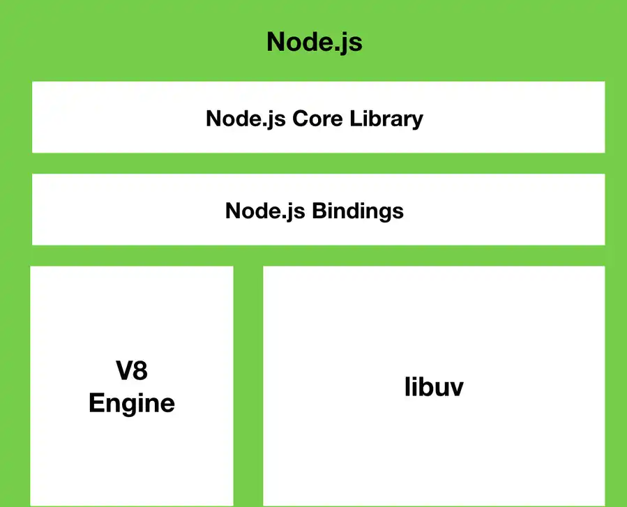

- 블로킹 및 논블로킹

  - 참조 :https://nodejs.org/en/docs/guides/dont-block-the-event-loop/

- 코어 모듈 nodejs
  - 참조 https://nodejs.org/dist/latest/docs/api/
- 이벤트 루프 nodejs
  - 참조 : https://nodejs.org/en/docs/guides/event-loop-timers-and-nexttick/

> nodejs에 대해서 어떤 방식으로 돌아가고 어떤흐름인지 알고싶어졌다 .

# Node JS Event Loop

- nodejs는 싱글 스레드 논 블로킹 이라고한다 .

  - 하나의 스레드로 동작하지만 I/O 작업이 발생할 경우 이를 비동기적으로 처리할수있다.
    - 여기서 싱글스레드란 ?
      - <b>하나의 프로세스에서 오직 하나의 스레드로 만 실행.</b>
  - 분명 하나의 스레드는 하나의 실행 흐름을 가지고 해야하지만 기다려야하는 작업을 실행하면 그작업이 끝나기전엔 아무것도 할수없는게 맞지만 ,nodejs 에서는 하나의 스레드만으로 여러 비동기 작업들을 블로킹
    없이 수행할 수 있고 그 기반에는 이벤트 루프가 존재함.

- 참고 https://seungtaek-overflow.tistory.com/18

## node js 구조



### module 여러가지 방법

```javascript
//app.js
const router =require('router);
console.log(router.     ......in ModuleFunction)

routes.js

module.exports = moduleTestFunction;
module.exports = {
  test: moduleTestFunction,
  hardCoding: "hard",
};
module.exports.test = moduleTestFunction;
exports.test = moduleTestFunction;
```

### 블로킹 (blocking)

- 직접 제어할 수 없는 작업이 끝날 때 까지 기다려야 하는 경우
- 호출된 함수에서 I/O 작업 등을 요청했을 경우 I/O 작업이 처리되 전까지 아무일도 하지 못한다

### Non-Blocking

- 직접 제어할 수 없는 작업이 완료되기 전에 제어권을 넘겨주는 경우를 말한다.
- 호출된 함수에서 I/O 작업등을 요청했을 경우 I/O 작업의 처리여부와 관계없이 바로 다음 작업을 할수있음.

## 코어 모듈

```javascript
파일시스템 모듈 ('fs')
경로 모듈('path')

const fs = require('fs'); //.. ('path')
```

```javascript
//rootdir
const path = require("path");

module.exports = path.dirname(process.mainModule.filename);


//원랜
const path = require('path')

router.get ( ...)=>{
  ...
  res.sendFile(path.join(__dirname, '...')) // 이런형태를
}

// 이후
const rootdir = require('../rootdir')
router.get(...)=>{
  ..
  res.sendFile(path.join(rootdir,'..'))
}

```

### controlelrs

```javascript

exports.get~~ = (req,res)=>{
  ...
  ...
}

//shop.js
const productController =require('../경로 ')

router.get('url',productController);

```
